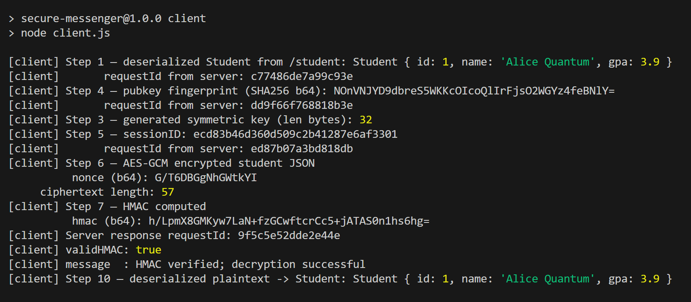
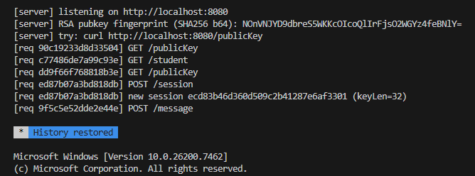

# Secure Messaging App (Node.js + REST)

https://psu.mediaspace.kaltura.com/media/Tahira+Maliks+Zoom+Meeting/1_bcih8axt

A full-stack messaging demo where a **Node client** and **Node server** communicate securely using:

* **RSA-2048** for **symmetric key (an AES-256 session key) exchange**
* **AES-256-GCM** for **fast encryption** of message content
* **HMAC-SHA256** for **integrity validation**
* **Base64** for **safe transmission** over JSON/HTTP
* **Request IDs** for traceability and Base64 length caps for safety

This implements the assignment’s **Steps 1–10** and adds **payload caps** + **request IDs** for traceability.

## Features (mapped to Steps 1–10)

1. **Serialization (Client)** – Serialize a `Student` object to JSON.
2. **Connectivity** – REST over HTTP between client and server.
3. **Key Generation (Server)** – Server generates **RSA-2048** key pair at startup.
4. **Key Exchange (Public Key)** – Client fetches server public key (`GET /publicKey`, DER Base64).
5. **Key Exchange (Session Key)** – Client generates **AES-256** key, encrypts with RSA-OAEP(SHA256), POSTs to `/session`; server decrypts with private key and stores `{sessionID → AES key}`.
6. **Encryption (Client)** – Client encrypts serialized `Student` JSON using **AES-256-GCM** (ciphertext||tag).
7. **Integrity (Client)** – Client computes **HMAC-SHA256** over the ciphertext.
8. **Integrity Check (Server)** – Server recomputes and **constant-time compares** HMAC.
9. **Decryption (Server)** – Server decrypts **AES-GCM** and returns **plaintext (Base64)**.
10. **Deserialization (Client)** – Client decodes Base64 → JSON → **`Student` object**.

**Defense-in-Depth:** request IDs (header + JSON), JSON body size limit, Base64 length caps, sessionID validation.
## Project Structure

server.js        # REST API (Steps 1–5, 8–9) + safety controls
client.js        # Client flow (Steps 1, 3–7, 10)
student.js       # Minimal Student class (id, name, gpa)
package.json
README.md

## Prerequisites

* **Node.js 18+** (uses global `fetch`).

  * If Node < 18, install `node-fetch@2` and uncomment it in `client.js`.
*  No external databases needed (sessions are in memory).

## Install

npm install

## ▶️ Run

**Terminal 1 – Server**

node server.js

or 

npm run server

Output:

[server] listening on http://localhost:8080
[server] RSA pubkey fingerprint (SHA256 b64): NOnVNJYD9dbreS5WKKcOIcoQlIrFjsO2WGYz4feBNlY=
[server] try: curl http://localhost:8080/publicKey

**Terminal 2 – Client**

node client.js

or npm run client

Output:

**Expected Server Logs**

After the client runs, the server terminal 1 prints one line per request with a request ID:

These confirm:

/publicKey (Step 4) served

/student (Step 1 demo) served

/session (Step 5) received and 32-byte AES key stored under a sessionID

/message (Steps 8–9) processed (HMAC verify + AES-GCM decrypt)

## API Endpoints

### `GET /publicKey`

Returns the **RSA public key** (DER Base64) + fingerprint.

**Response**

json
{
  "requestId": "…",
  "publicKey": "<base64 DER>",
  "fingerprint": "<sha256 base64>"
}

### `POST /session`

Accepts **RSA-OAEP(SHA256)** encrypted AES key, creates a session.

**Request**

json

{ "encryptedKey": "<base64>" }

**Response**

json

{ "requestId": "…", "sessionID": "<32-hex-chars>" }

### `POST /message`

Verifies **HMAC**, then **AES-GCM decrypts**, and returns plaintext (Base64).

**Request**

json
{
  "sessionID":  "<hex>",
  "ciphertext": "<base64 data||tag>",
  "nonce":      "<base64 12B>",
  "hmac":       "<base64 32B>"
}

**Response (success)**

json
{
  "requestId": "…",
  "validHMAC": true,
  "message": "HMAC verified; decryption successful",
  "plaintextB64": "<base64 json>"
}

**Response (tampered)**

json
{
  "requestId": "…",
  "validHMAC": false,
  "message": "HMAC verification failed (tampered?)"
}

## 🔐 Cryptography Details

* **RSA-2048** key pair generated at server startup (`crypto.generateKeyPairSync`).
* **OAEP-SHA256** for encrypting the AES session key (modern padding).
* **AES-256-GCM** for message encryption (confidentiality + authenticity tag).
* **12-byte nonce** (GCM standard) and **16-byte tag** appended to ciphertext.
* **HMAC-SHA256** computed over **ciphertext** (integrity), compared with `timingSafeEqual`.
* All binary fields are transported as **Base64** in JSON.
* **Request IDs** Every response includes X-Request-ID header and requestId in JSON body to tie client and server logs.

## Security Controls Included

* **Request IDs**: Created per request, returned in `X-Request-ID` header and JSON body for tracing.
* **JSON body size cap**: `express.json({ limit: "8kb" })` guards against oversized payloads.
* **Base64 caps** (server constants):

  * Encrypted RSA key ≤ **600** chars
  * Nonce ≤ **64** chars
  * HMAC ≤ **128** chars
  * Ciphertext ≤ **8192** chars
* **Session ID validation**: 32 hex chars (`/^[a-f0-9]{32}$/i`).
* **AES key length check**: decrypted symmetric key must be **exactly 32 bytes** (AES-256).
* **Constant-time compare**: `crypto.timingSafeEqual` for HMAC.

##  Example Flow

1. Client GETs `/publicKey` → builds RSA public key object (validates fingerprint).
2. Client generates random 32-byte AES key → RSA-encrypts with OAEP-SHA256 → POST `/session`.
3. Server private-decrypts key, validates **32 bytes**, stores in `sessions[sessionID]`.
4. Client AES-GCM encrypts `Student` JSON → computes HMAC over ciphertext → POST `/message`.
5. Server verifies HMAC in constant time → decrypts AES-GCM → returns plaintext Base64.
6. Client decodes Base64 → parses JSON → constructs `Student` instance.

## cURL Snippets 

Get public key (DER Base64)

curl -s http://localhost:8080/publicKey | jq .

Quick health: demo JSON (server-side serialization)

curl -s http://localhost:8080/student | jq .

## 🪲 Troubleshooting

* **`fetch is not defined`** → Use Node 18+, or `npm i node-fetch@2` and import it in `client.js`.
* **`session error` / `message error`** → Check Base64 sizes vs the caps and field names.
* **HMAC fails** → Ensure you reuse the same `sessionID` and do **not** modify ciphertext.
* **GCM decryption fails** → Nonce must match; AES key must match stored session key.

## Configuration

* Server port: **8080** (edit `PORT` in `server.js`).

* Client server URL: **(http://localhost:8080)** (edit `SERVER` in `client.js`).

## License / Acknowledgements

Coursework project for secure systems. Uses Node’s built-in `crypto` and `express`.

